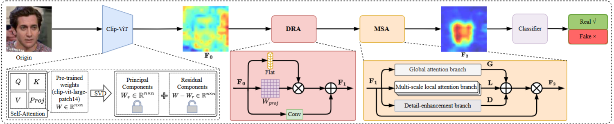

# Towards Generalizable Deepfake Detection via Rank Adaptation Network

<b> Authors: Changcun Liu, Qilei Li, Guisheng Zhang, Siyou Guo, and Mingliang Gao* </b>

[[pre-trained weights](https://drive.google.com/drive/folders/1Km03VoGyfrM6v6LJqTLtv6GGwz2-kiWQ)]

> **News:**
The pre-trained weights of clip-vit-large-patch14 for training CADNet are [here](https://drive.google.com/drive/folders/1Km03VoGyfrM6v6LJqTLtv6GGwz2-kiWQ/clip-vit-large-patch14)

---

<div align="center"> 
</div>
<div style="text-align:center;">
  
</div>

---

The following two tables present the results of our method in the facial deep-forge detection benchmark test set as well as the corresponding module ablation results.. Please refer to our paper for more results.
<div align="center"> 
</div>
<div style="text-align:center;">
  
</div>
<div align="center"> 
</div>
<div style="text-align:center;">
  
</div>

---

## ⏳ Quick Start (if you just want to do the *inference*)
<a href="#top">[Back to top]</a>


### 1. Installation
Please run the following script to install the required libraries:

```
sh install.sh
```

### 2. Download checkpoints
If you are a deepfake player, more interested in face deepfake detection:
- The checkpoint of "CLIP-L14 + our CADNet" **training on FaceForensics++ (FF++)** are released at [Google Drive](https://drive.google.com/drive/folders/1Km03VoGyfrM6v6LJqTLtv6GGwz2-kiWQ).
- The above checkpoints are only applicable for the testing of the Celeb-DF-v1 dataset. The remaining checkpoints will be gradually uploaded in the future. 

### 3. Run
You can then infer the Celeb-DF-v1 dataset using the pretrained weights. 

Specifically, run the following line:

```
cd CADNet/

python3 training/test.py \
--detector_path ./training/config/config/detector/cadnet.yaml \
--test_dataset "Celeb-DF-v1" \
--weights_path  {CKPT}.pth
```

---

## 💻 Reproduction and Benchmarking Evaluation

<a href="#top">[Back to top]</a>

### 1. Download datasets

If you want to reproduce the results of each deepfake dataset, you can download the processed datasets from [DeepfakeBench](https://github.com/SCLBD/DeepfakeBench). 

### 2. Preprocessing (**optional**)

If you only want to use the processed data we provided, you can skip this step. 

Otherwise, you need to use the following codes for doing **data preprocessing strictly following DeepfakeBench**.

### 3. Rearrangement (**optional**)

> "Rearrangement" here means that we need to **create a *JSON file* for each dataset for collecting all frames within different folders**. Please refer to **DeepfakeBench** for the provided JSON files for each dataset.

After running the above line, you will obtain the JSON files for each dataset in the `./preprocessing/dataset_json` folder. The rearranged structure organizes the data in a hierarchical manner, grouping videos based on their labels and data splits (*i.e.,* train, test, validation). Each video is represented as a dictionary entry containing relevant metadata, including file paths, labels, compression levels (if applicable), *etc*. 

### 4. Training

First, you can run the following lines to train the model:
- For multiple GPUs:
```
python3 -m torch.distributed.launch --nproc_per_node=4 training/train.py \
--detector_path ./training/config/detector/cadnet.yaml \
--train_dataset FaceForensics++ \
--test_dataset Celeb-DF-v1 \
--ddp
```
- For a single GPU:
```
python3 training/train.py \
--detector_path ./training/config/detector/cadnet.yaml \
--train_dataset FaceForensics++ \
--test_dataset Celeb-DF-v1 \
```

### 5. Testing

Once you finish training, you can test the model on several deepfake datasets.

```
python3 training/test.py \
--detector_path ./training/config/detector/cadnet.yaml \
--test_dataset Celeb-DF-v1 \
--weights_path ./training/weights/{CKPT}.pth
```
Then, you can obtain similar evaluation results reported in our manuscript.

---

## Additional Information
- All experiments were implemented in PyTorch with an NVIDIA GeForce RTX 3090 Ti GPU.
- Before training, it is necessary to ensure that the GPU has at least 20 GB of available memory.
- Before testing, it is necessary to ensure that the GPU has at least 7 GB of available memory.
- The remaining key information is still being uploaded.
